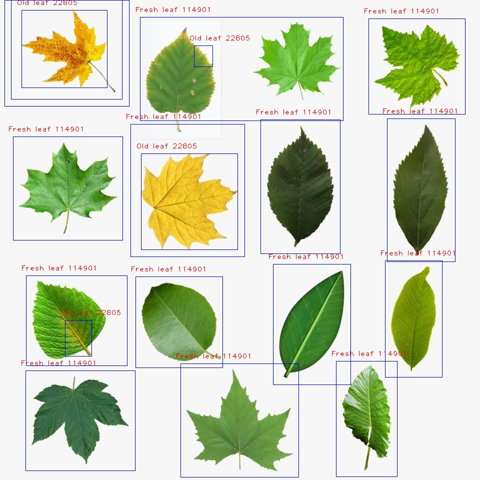
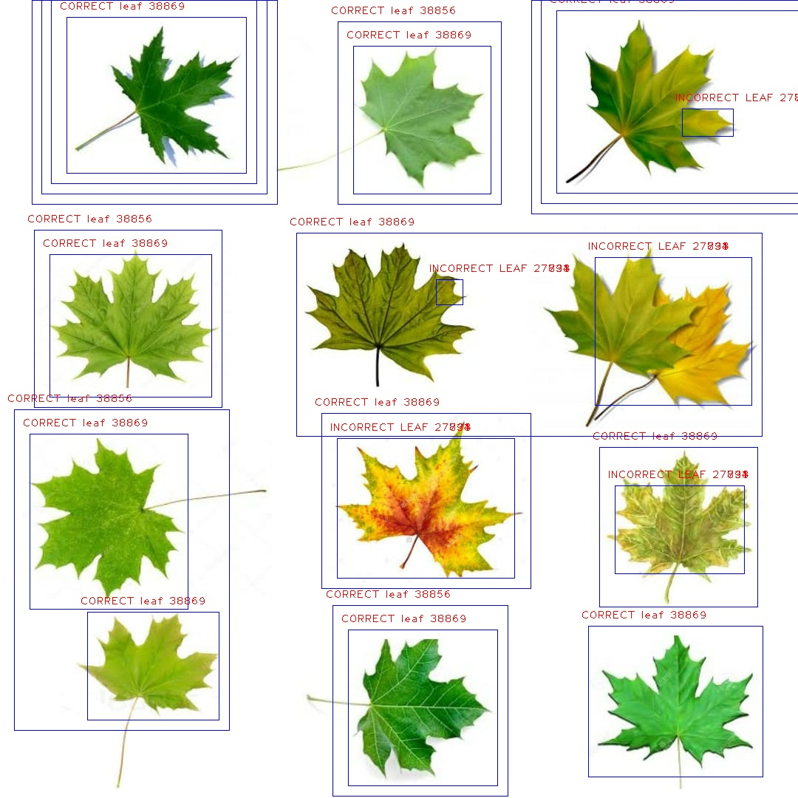
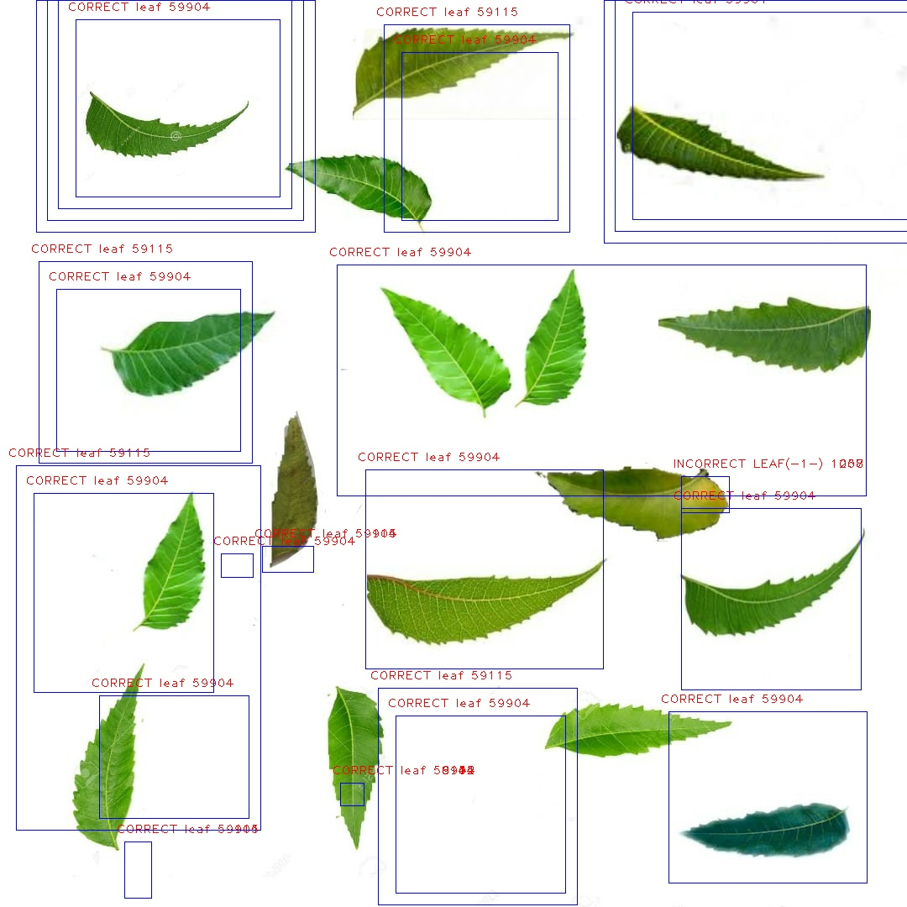

# Invicta-ImageProcessing
The detection of old and new leaves by masking and making a rectangle around the images by contour detection.
# screenshots
## output1 

  

## output2 

  

## output3 

  

## output4 

  

